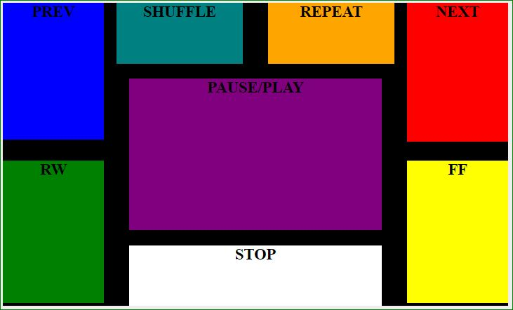

# Mazda Videoplayer
## Videoplayer app for Mazda cars with Mazda Connect v55+
#### [Changelog](CHANGELOG.md)

**It works better if you start the car without usb connected. Insert only the usb with movies. Stop the music player and then start the videoplayer.**

**To hear the video player sound select the active audio source as the same USB as the videos you are playing.  Pause audio or play a silent track then start the video and you will hear sound.**
#### Multicontroller Actions:
  Multicontroller Action   |   [ In Video List ]     |  [ During Playback ]
 --- | --- | --- | ---
  Press Command Knob    |   Select video     |   Play/pause  
  Tilt Up      |   Video list pgup    |   Toggle fullscreen(next video)   
  Tilt Down      |   Video list pgdn    |   Stop       
  Tilt Right      |   Scroll Options   |   Next    
  Tilt Left      |   Scroll Options    |   Previous  
  Rotate Command Knob CCW   |   Scroll video list up   |   RW (10 seconds)  
  Rotate Command Knob CW   |   Scroll video list down | FF (10 seconds)
#### ScreenTap Actions [ During Playback ]:

Action: | Play/Pause | Stop | Prev | Next | RW | FF | Shuffle | RepeatAll
---|---| --- | --- | --- | --- | --- | ---
**Tap Area:** | Center | Bottom Center | Top Left | Top Right | Bottom Left | Bottom Right | Top RightCenter | Top LeftCenter

